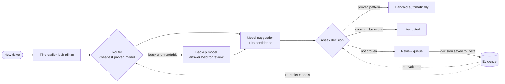

<div align="center">

<picture>
  <source media="(prefers-color-scheme: dark)" srcset="docs/brand/assay-logo-dark.png">
  
</picture>

### AI agents, verified.

**An AI agent manager that decides, with evidence, which model to use, what an agent may do on its own,
and whether a change actually helped. Built on Databricks.**


**Badger BuildFest 2026** · Applied AI & Automation · Databricks Real-World Workflows (Xorbix) · The Art of the Break

[**Devpost**](https://devpost.com/software/undecided-dsevk2) ·
[**Demo video**](https://www.youtube.com/watch?v=Xhl1AXFDvE8) ·
[**Live dashboard**](https://assay-manager-7474654480147366.aws.databricksapps.com) ·
[**Final handoff**](docs/FINAL_HANDOFF.md) ·
[**Full report**](docs/ASSAY_REPORT.md) ·
[**Break Card**](docs/META_ART_OF_BREAK_CARD.md) ·
[**Submission kit**](docs/SUBMISSION_KIT.md)

<a href="https://www.youtube.com/watch?v=Xhl1AXFDvE8"></a>

</div>

---

> ### When 8 AI models said they were 95% sure, they were wrong **1,793 times out of 2,321**.
> We graded **5,125** answers against what the Apache maintainers actually did. Confidence is not evidence.
> Assay is built on that fact.

---

## Contents

- [The problem](#the-problem)
- [What Assay does](#what-assay-does)
- [How it works](#how-it-works)
- [Results at a glance](#results-at-a-glance)
- [The dashboard](#the-dashboard)
- [The live demo](#the-live-demo)
- [How we measured](#how-we-measured)
- [Built on Databricks](#built-on-databricks)
- [The Art of the Break](#the-art-of-the-break)
- [What we do not claim](#what-we-do-not-claim)
- [Run it yourself](#run-it-yourself)
- [Repository map](#repository-map)
- [Team](#team)

---

## The problem

AI agents keep asking for more freedom: **act without asking**, **run on a cheaper model**, **learn from a
correction**. Most teams decide on gut feel, or on the model's own confidence. Both fail quietly:

- A confident model is not a correct one. In our tests, answers rated "95%+ sure" were wrong **77%** of the time.
- The cheapest model is rarely safe as-is, and the most expensive one is rarely necessary.
- A correction that sounds sensible can break more than it fixes.

Assay replaces gut feel with **proof**: a verdict with an error bar, or an honest *"not proven yet, needs N more."*

## What Assay does

Assay sits between a company's AI agents and the people who review their work, and answers four questions with
evidence:

| | Question | How Assay decides |
|---|---|---|
| 🧭 | **Which model should answer?** | The *cheapest* model that is proven good enough for this task. If it is busy or returns junk, switch live to a backup. |
| 🔓 | **May the agent act alone?** | Only where its checked track record proves it: the 95% lower bound on precision must reach 90%. |
| 🧠 | **Can past decisions be reused?** | Only for *kinds of cases* whose past answers are proven, verified by hiding each decision and predicting it. |
| 🧪 | **Did a correction really help?** | Tested on fresh cases before it is switched on: *fixes N, breaks M*, exact sign test. |

**The example agent** triages the public **Apache Jira** (Spark, Kafka, Flink, Hive): for each new ticket it decides
whether an earlier ticket is the *same problem*, a *larger effort it belongs to*, *related*, or *nothing*. Jira is the
proving ground; **Assay is the product**, and it works for any agent that proposes actions.

## How it works



Every answer becomes evidence. When the evidence changes, the model choice and the automation change with it,
including **revoking** automation when a counterexample appears.

## Results at a glance

**1,362 real tickets × 8 models = 9,841 calls on Databricks**, every answer graded against the maintainers' own
record (duplicate links, parent tickets, how each ticket was closed). No human or AI labels.

| | |
|---|---|
| 🎯 **Answers verified** | **5,125** |
| ⚠️ **High-confidence false positives** | **1,793 of 2,321** answers rated ≥95% confident were wrong |
| ✅ **Patterns proven and automated** | **3** (e.g. *a version upgrade is not a duplicate*: **248 of 249**) |
| 🔁 **Past decisions reused correctly** | **511 of 512** (leave-one-out, lower bound 99.1%) |
| 🚦 **Answered without a person under load** | **750 of 800** routed requests (568 live switches) |
| 💸 **Estimated compute cost of the whole evaluation** | **≈ $4.36** at list price · actual spend **$0** |

### Which models can you trust?

| Model | Assay's role | Precision* | Rated ≥95% sure, but wrong | Cost / 1,000 tickets** |
|---|---|---|---|---|
| gpt-oss 120B | Backup | **71%** | 47 of 104 | $0.51 |
| Llama 3.3 70B | Backup | 60% | 13 of 21 | $0.62 |
| **gpt-oss 20B** | **Primary** | 58% | 58 of 92 | **$0.26** |
| Llama 4 Maverick | Excluded | 41% | 30 of 42 | $0.64 |
| Qwen3-Next 80B | Excluded | 31% | 275 of 340 | $0.43 |
| Gemma 3 12B | Excluded | 16% | 395 of 432 | $0.27 |
| Llama 3.1 8B | Excluded | 4% | 179 of 188 | $0.21 |
| Qwen3.5 122B | Excluded (46 answers, rate-limited) | 71% of 14 | 1 of 8 | $9.25 |

<sub>\*Share of answers the maintainer record confirms, among those it can settle (800 random stream tickets).
\*\*Databricks list price in DBU per million tokens × an assumed $0.07/DBU, from measured tokens.</sub>

**Why the primary is not the most precise model.** Assay's rule is *cost-optimized with a quality floor*: the cheapest
model within 5 points of the reference, not significantly worse on the same tickets, and reliable. **gpt-oss 20B**
is **57% cheaper** than Llama 3.3 70B with no proven loss in precision. The quality-optimized alternative,
**gpt-oss 120B**, is **13 points more precise at 1.9× the cost**, so it serves as the first backup.

### What Assay learned (and automates)

| Kind of case → answer | Evidence | Status |
|---|---|---|
| A version upgrade is **not the same problem** as an earlier upgrade to another version | 248 of 249 | ✅ automated |
| Version upgrades are **not part of** each other | 219 of 219 | ✅ automated |
| Two tickets with identical titles are **not part of** each other | 44 of 44 | ✅ automated |
| Links **across Apache projects** are right | 0 of 137 | 🛑 always interrupted |
| Identical titles mean **the same problem** | 115 of 609 | 🛑 never merge on title |
| Version upgrades are **related** | 57 of 61 | ⏳ pending: 28 more agreeing human decisions |

**No model has earned the right to act alone**, and Assay says exactly what it would take.

### Why confident answers fail

| Cause | Share of the 1,793 |
|---|---|
| Filed under the wrong parent project | 45% |
| Called a duplicate, but resolved on its own | 39% |
| Sibling tasks mistaken for duplicates | 8% |
| Wrong kind of link | 4% |
| Tickets from different projects | 4% |

Full numbers, methods and sources: [`docs/FINAL_HANDOFF.md`](docs/FINAL_HANDOFF.md) ·
raw evidence: [`results/heavy-eval/`](results/heavy-eval/).

## The dashboard

**[assay-manager-7474654480147366.aws.databricksapps.com](https://assay-manager-7474654480147366.aws.databricksapps.com)**
(a Databricks App; workspace login required). Designed for a manager who has never written a prompt.

- **Key figures** and a **live replay**: press play and watch the verdicts form as tickets arrive. Models change
  roles, patterns are automated, automation is revoked when a counterexample appears.
- **Model evaluation**, ranked by precision, with the reason behind every role.
- **Detailed statistics**: Assay's model choice (cost-optimized vs quality-optimized), a price-vs-performance chart,
  calibration, definition ambiguity, and evidence coverage (proven, ruled out, pending).
- **Cost & savings**, **model routing** under load, and a **review queue** where every decision is written to Delta.
- **A guided tour** that expands each section's explanation and has you review one real suggestion.

Deep links: `#tour` · `#play` (start the replay) · `#replay=N` (a point in the replay).

## The live demo

Press the gold **Live demo** button, write a Jira ticket (or pick a template), and watch Assay handle it live on
Databricks:

| Scenario | What happens | Measured |
|---|---|---|
| **The cheapest model on a version upgrade** (*Upgrade Netty to 4.2.8.Final*) | Llama 3.1 8B says "same problem, 90–100% sure". Assay: 🟢 **handled automatically**, it's a proven mistake (248 of 249) | 10 of 10 |
| **A copy from another project** | The model says "duplicate, 95%". Assay: 🔴 **interrupted**, cross-project links were right 0 of 137 times | as expected |
| **A genuinely new request** | 🟡 **Sent to you**: nothing proven applies, so a person decides | as expected |

> *Even if you switch to the cheapest model, Assay catches its known mistakes automatically. That is how Assay makes
> cheap models safe, and why even a correct, 96%-confident answer waits until the evidence proves the pattern.*

Demo tickets carry a gold border, are written to a sandbox table and never reach Jira or the evidence.

## How we measured

- **An honest sample.** Precision is measured only on **800 tickets drawn at random** from the live stream. Targeted
  slices (93 known duplicates, 80 version upgrades, 50 test-failure reports, 339 boosters for rare kinds of case) are
  chosen from ticket text alone, never from the answer, and never counted in precision.
- **Ground truth from the maintainers.** Each answer is *confirmed*, *contradicted* or *unlinked* by the Apache
  maintainers' own actions. Unlinked answers count neither way.
- **Statistics with error bars.** One-sided Clopper-Pearson bounds; *proven* means the 95% lower bound is at least 90%;
  paired sign tests between models on the same tickets.
- **Guards against fooling ourselves.** Kinds of case the grader itself defines (parent tickets) are excluded from
  claims. "Related" can never be contradicted by the record, so it is counted strictly. Frozen, hash-checked plans;
  every failure kept as data.
- **Humans stay the source of truth for automation.** We prepared an AI-assisted review that would have pushed one
  more pattern over the bar (147 of 152 agreed) and **chose not to apply it**: the evidence that automates AI
  decisions has to come from people or real outcomes.

## Built on Databricks

| | |
|---|---|
| **Unity Catalog** (`workspace.assay_triage`) | 37,853 tickets, 13,687 maintainer links, the full evaluation (`heavy_scorecard`, `heavy_summary`, `heavy_cases`), every review decision (`actions`), every routed request (`routing_log`) |
| **Foundation Model APIs** | 8 chat models: Llama 3.3 70B, Llama 3.1 8B, Llama 4 Maverick, gpt-oss 120B, gpt-oss 20B, Qwen3-Next 80B, Qwen3.5 122B, Gemma 3 12B |
| **Databricks Apps** | the dashboard (FastAPI + one page); its service principal reads the tables, writes decisions and calls the models |
| **SQL warehouse** | Serverless Starter; all reads and writes are parameterized SQL |

On Free Edition the AI Gateway's fallback works only for external models and its usage tables are not readable, so
live switching and evaluation-driven routing are Assay's own.

## The Art of the Break

We broke our own system on purpose, and wrote down every failure:

| What broke | Evidence |
|---|---|
| "95% sure" was wrong 1,793 of 2,321 times | the evaluation |
| A plausible rule ("version upgrades are duplicates") fixed 0 and broke 16 | tested before use; blocked |
| Our first sample was rigged (balanced, answers inserted) | caught in code review; rebuilt on a random stream |
| **Prompt injection** on the real Llama 3.3 70B endpoint: 2 of 3 attacks made it call unrelated tickets duplicates at 100% | [`docs/META_ART_OF_BREAK_CARD.md`](docs/META_ART_OF_BREAK_CARD.md) |
| Six security weaknesses (forgeable receipt hash, anonymous direct writes, impossible confidence accepted) | [`results/security-tests/`](results/security-tests/SECURITY_TEST_RESULTS.md), kept as strict expected failures |
| Statistical attacks: one job counted as 50, cherry-picked wins, certifying too soon | [`docs/ART_OF_BREAK_BREAK_CARD.md`](docs/ART_OF_BREAK_BREAK_CARD.md) |

## What we do not claim

- No model has earned the right to act alone on any kind of case the record can check.
- The primary is 58% precise on checkable answers: the agent **suggests**, people decide, except for 3 proven patterns.
- Maintainers miss links, so measured precision is a lower estimate; "related" cannot be contradicted at all.
- Dollar figures are list-price estimates with an assumed $0.07/DBU; we paid $0.
- Routing numbers reflect Free Edition's low rate limits. Qwen3.5 122B was only partly tested.
- Six documented security weaknesses are still open. Four Apache projects and one task only.

## Run it yourself

```bash
pip install -r requirements.txt
python -m pytest -q tests                          # 88 passed, 6 xfailed (documented security breaks)

# Databricks: .env with DATABRICKS_HOST, DATABRICKS_TOKEN, DATABRICKS_WAREHOUSE_ID (your own token)
python scripts/fetch_data.py                       # data files from the Unity Catalog volume
uvicorn app.manager.server:app --port 8000         # the dashboard locally, against the live tables
python scripts/deploy_manager.py                   # deploy / redeploy the Databricks App

# the evaluation ($0 on Free Edition; model calls are off unless you opt in)
ASSAY_ALLOW_MODEL_CALLS=1 python scripts/heavy_eval.py run --workers 3
ASSAY_ALLOW_MODEL_CALLS=1 python scripts/heavy_eval.py route --workers 6 --delta --tag normal
python scripts/heavy_grade.py --replay 50 --delta  # grade, build the replay, publish the tables
python scripts/live_route.py --policy-from-eval    # cheapest proven model -> routing policy
python scripts/sync_results.py                     # dashboard tables
```

New to the workspace? Start with the quick start in [`docs/DATABRICKS_SETUP.md`](docs/DATABRICKS_SETUP.md).

## Repository map

```
assay_engine/     the product: bounds, bands, permissions, precedent (pattern memory), router, learning gate
assay_triage/     the example agent: Jira ingest, time-honest retrieval, LLM judge, Databricks client
app/manager/      the dashboard: server.py (FastAPI API) + static/index.html (page, replay, tour, live demo)
scripts/          heavy_eval.py · heavy_grade.py · live_route.py · sync_results.py · deploy_manager.py · ...
results/          every number we quote: heavy-eval/, stage-2-3-runs/, art-of-break/, security-tests/, ...
docs/             FINAL_HANDOFF · ASSAY_REPORT (+PDF) · SUBMISSION_KIT · Break Cards · DATABRICKS_SETUP · SCHEMA
tests/            engine, app, grader, precedent and security tests
```

| Document | For |
|---|---|
| [`docs/FINAL_HANDOFF.md`](docs/FINAL_HANDOFF.md) | every final number with its source, demo scripts, slide outline, judge Q&A |
| [`docs/ASSAY_REPORT.md`](docs/ASSAY_REPORT.md) ([PDF](docs/ASSAY_REPORT.pdf)) | the build story, methods and earlier results |
| [`docs/SUBMISSION_KIT.md`](docs/SUBMISSION_KIT.md) | Devpost answers and video script |
| [`results/heavy-eval/REPORT.md`](results/heavy-eval/REPORT.md) | the evaluation's generated report |

## Team

Built at Badger BuildFest 2026 (UW–Madison) by **Ananda-001**, **Mohith Nikesh** and **Soham Vazirani**, with Claude
(Anthropic) as a coding partner; commits it helped write carry a `Co-Authored-By` line.

All code was written at the event: development started in a local folder at 11:00 on Sep 26 and moved into this repo
at about 15:30. Earlier ideas are credited in [`docs/thinking/`](docs/thinking/); no code was carried over.

Licensed under the [MIT License](LICENSE).

<div align="center">

**Agents earn their freedom.**

</div>
